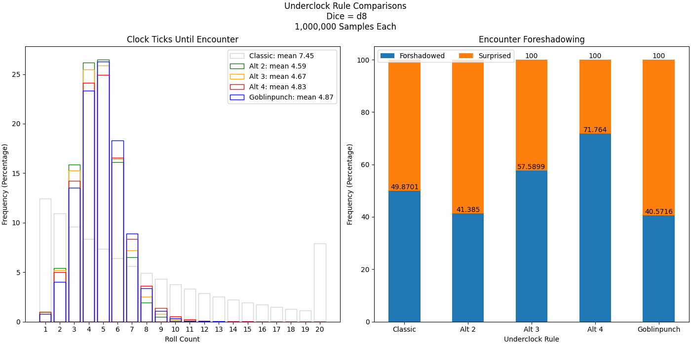
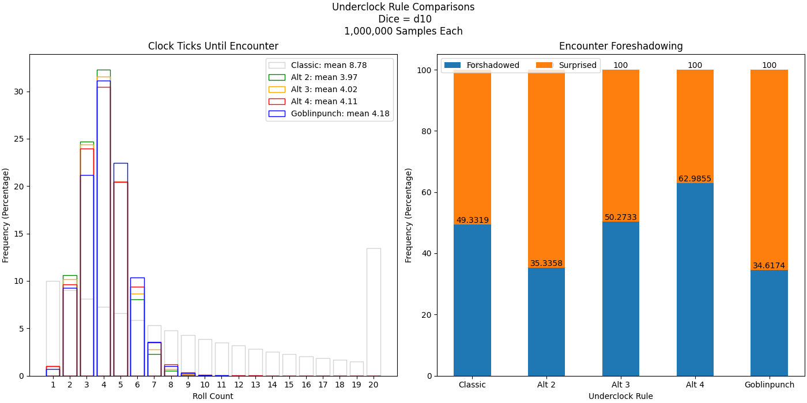
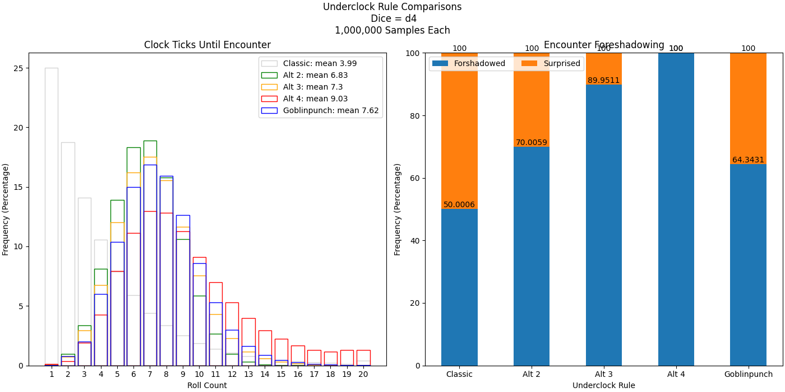

# Underclock

A simulator for the Underclock dungeon crawling mechanic originally suggested by
Arnold Kemp in their [Goblinpunch Blog](https://goblinpunch.blogspot.com/2023/04/the-underclock-fixing-random-encounter.html).

This improved implementation speeds up the computation substantially, while performing 100x more samples.
It also compares Arnold's original rule to several alternates of my own devising.

## Original Underclock Rule Summarized

- Ticks repeat on a Max roll (6 for d6)
- Encounter triggered when clock goes negative.
- Clock resets to 3 when it reaches exactly zero
- Omens triggered when clock == 3

## My Alternatice Underclock rule.

- Ticks repeat on a Max roll (6 for d6)
- Encounter triggered when clock reaches zero (or goes negative.)
- Clock resets to `x` whenever below x but still running
- Omens triggered when clock <= `x`

Below are the plots comparing the original rule to my alternate rules with different
values of x, and for different sizes of dice. With these results I believe my "Alt 3"
rule, where x == 3, is the my prefered improvement over the original rule. It maintains the
same distribution and a similar mean number of rolls-till-encounter as the original
rule, but foreshadows encounters more frequently (which I like) while resetting the clock
more frequently, keeping the exact moment of encounter more uncertain than in the original.

